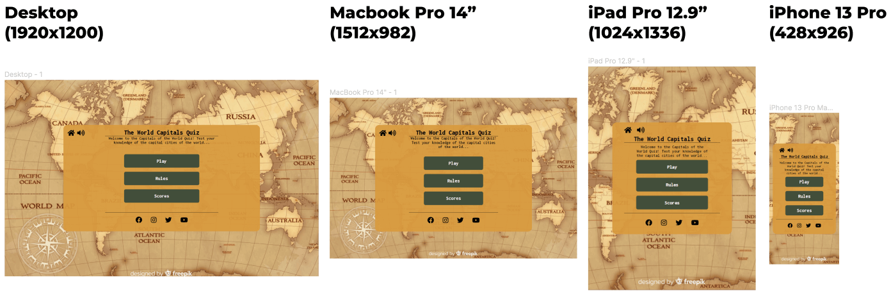
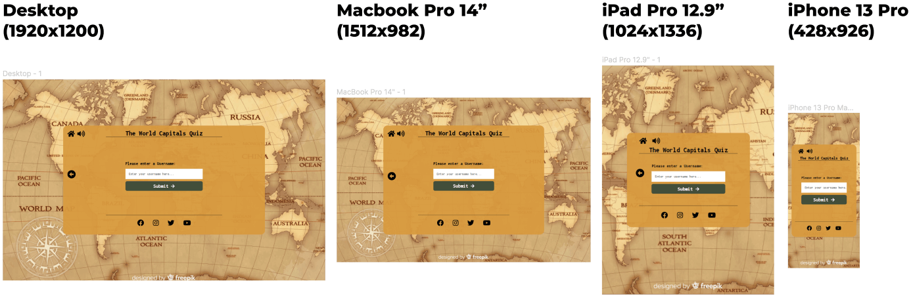
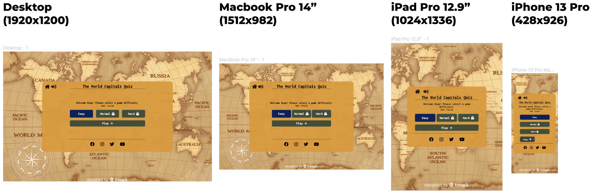
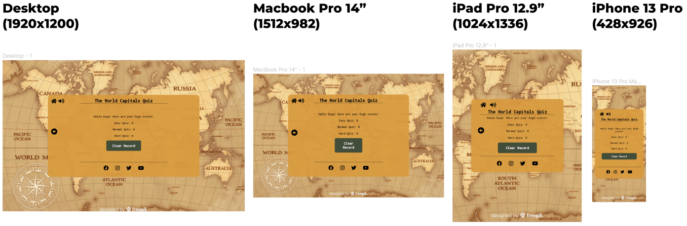

# **The Capitals of the World Quiz**

## **Brief**
The Capitals of the World Quiz is a multiple choice quiz game that tests a user's knowledge of nation capitals throughout the world. The quiz includes 243 questions spread across three quiz difficulties and aims to provide the user with an engaging and challenging game experience.

[Link to the live site](https://kippad.github.io/portfolio-project-2/index.html)

## Contents 
- [UX (User Experience)](#ux-user-experience)
    - [Objectives](#objectives)
    - [Target Audience](#target-audience)
    - [Action Plan](#action-plan)
- [Design](#design)
    - [Inspiration](#inspiration)
    - [Color Scheme](#color-scheme)
    - [Typography](#typography)
    - [Wireframes](#wireframes)
- [Features](#features)
    - [Current Features](#current-features)
    - [Future Features](#future-features)
- [Technology](#technology)
- [Testing](#testing)
- [Deployment](#deployment)
    - [To deploy the project](#to-deploy-the-project)
    - [To clone the project](#to-clone-the-project)
- [Credits](#credits)
    - [Code](#code)
    - [Media](#media)
    - [Acknowledgements](#acknowledgments)

---

## **UX (User Experience)**

### **Objectives**
The UX objectives of the project are:

1. The application interface is intuitive to a first time user, its function and purpose is clear, and the navigation is progressive and natural. The user enjoys using the site and actions come as second nature to them.

2. To build an application with an aesthetically pleasing design that is responsive across multiple devices, and that elicits a positive emotional response from the user.

[Back to contents](#contents)

### **Target Audience**
The target audience for this project has the scope to be very broad. Some examples include: 

- Children/younger people using the game for education.
- Recreational/casual users playing for entertainment.
- Users that are serious about geography, playing to revise/test their knowledge.

[Back to contents](#contents)

### **Action Plan**
The Capitals of the World Quiz was designed to meet the UX objectives and ensure that each of these target demographics has a positive experience:
 
1. Navigation is clear so that users of all ages are able to move through the game easily. Where a user can initiate an action it is obvious and clearly marked with buttons and icons. Feedback is given to user actions through modals, elements responding to the mouse, tooltips and sound effects.

2. Questions are divided into different difficulties, enabling casual or younger users to work through the game incrementally without being overloaded with questions that are too difficult, and allowing more advanced users to test their knowledge of tougher questions. These difficulties can be unlocked when a user achieves a certain threshold of correct answers, adding an objective to the game and meaning that users will be able to settle on their level of difficulty through playing. 

3. The design is responsive to different devices and screen widths, maintaining its aesthetic throughout the application. This makes the user's time on the application more enjoyable and increases the likelihood of them returning.

[Back to contents](#contents)

## **Design**

### **Inspiration**
---

    
    

The design of the application drew inspiration from old explorer maps from the 1800’s. The background was selected for its aged and haggard feeling, and the game panel is meant to look loosely like a telegraph message that might have been found around the same time. The design is simple and typography limited in order to reflect this.

[Back to contents](#contents)

### **Color Scheme**
---

The colors on the application were generated with [**Coolors**](https://coolors.co/) and were chosen to complement the map and aesthetic.

[Back to contents](#contents)

### **Typography**
---

**Inconsolata** is the only font used in the application. This particular font was chosen due to its resemblance to the sort of typography seen on a telegraph.
  
[Back to contents](#contents)
 
### **Wireframes**
---
[**Figma**](https://www.figma.com/) was used to wireframe the design of the application.

#### **Main Menu**

#### **Username Input**

#### **Difficulty Selection**

#### **Game Area**

The wireframes were used as a guide throughout development. The final product does differ slightly in certain areas, but mostly stays true to the original vision of the project.

[Back to contents](#contents)

## Features

### **Current Features:**

### **Main Menu**
---

The main menu is the first thing that the user sees when loading the application, and it acts as staging area from which all other areas are accessed.

- The main title and subheading prioritizes explaining the purpose of the application to the user.
- Menu buttons indicate navigation options to the user (To initiate the game, to read the rules, and to check high scores).
- The icons for home, sound, and social media are fixed to the panel and accessible from anywhere on the site.
- The sound icon toggles game sounds on and off.

### **Username Input**
---

From the main menu, the play button will take the user to a form area where a username is entered into in an input.

- A user can log a username which will be stored in local storage.
- If a username exists, it will skip this area and take the user directly to the difficulty selection.
- The username is logged with a user's high scores, which allows them to track their game record by accessing the scores page from the main menu.
- The input is validated, preventing users for submitting empty values.

**Difficulty Selection**
---

The difficulty selection form is loaded once a username exists, allowing the user to select the question difficulty for the upcoming game.

- Three different levels of difficulty: Easy, Normal, Hard.
- Normal and Hard difficulties are locked by default and are unlocked if 75% of questions are answered correctly in a quiz of the preceding difficulty.
- Upon loading the form with the correct score, the padlock is removed and the next difficulty becomes playable.
- The user can clear the existing name and its corresponding local data in order to revert back to the username input area.

### **Game Area**
---

Once a difficulty is chosen the game area is loaded - this is where the questions and answers are generated.

- The questions are shuffled, ensuring that the user will face a different selection of questions on each playthrough.
- The answer buttons are filled with randomly selected answers from the collection of questions.
- The correct answer replaces one of the randomly generated answers if it does not already exist.
- Correct and incorrect answers are signified by the button changing green or red when clicked on. 
- The next question is automatically loaded after a two second timer.
- The counters on the page track the current question, the current count of correct answers, and the user's high score for that difficulty (If the current score count exceeds the high score, then the high score counter incriments up alongside the score counter).

### **High Scores**
---

The high score page is where a user can check their record for each of the game difficulties.
- The user’s high score count is displayed for each of the difficulty levels.
- A clear data button is included, allowing the user to wipe local data and return to the application’s main menu.

### **Sounds**
---

 

The game includes sound effects in response to user actions. The sound icon at the top of the page can be accessed throughout the application and controls the game’s sound effects.

- Sound effects are triggered by button clicks, toggling the sound icon, modals appearing, and for correct and incorrect answers.
- The sound icon is located at the top of the screen and is accessible to the user throughout the application.
- The sound icon enables the user to toggle the applications sounds on and off.

### **Modals**
---  

Throughout the application modals pop up to respond to, and confirm, user actions.

- When choosing to wipe local data, both in the scores area and in the username input area, a modal appears asking the user to confirm the action.
- When clicking the home icon in the game area, a warning is presented to the user and asks for confirmation of the action.
- Upon completing a quiz a modal will appear with a button to the main menu, or if the user has answered 75% of the questions correctly, to the next quiz difficulty.
 
[Back to contents](#contents)

### **Future Features:**
---
Here are some examples for features that could be included in further development of the game.

- **Multiple Users**: Multiple profiles can be stored on the game, meaning that two users can play on the same device without wiping the others data.

- **More Modals Scenarios**: More modals to react to specific game scenarios, as under the current scope of the project the modal content remains quite generic.

- **Choosing Quiz Length**: A user can choose longer or shorter quizzes to test themselves further.

- **Master Quiz**: A quiz of every question in the game across all difficulties.

- **Multiple Themes**: Different skins and color palettes so that a user can customize how the application looks.

- **Leaderboard**: A global leaderboard that logs and ranks the high scores of all users.

[Back to contents](#contents)

## **Technology** 
The Capitals of the World Quiz was built with the following technologies:

1.  [**HTML**](https://en.wikipedia.org/wiki/HTML5) - Used to give content and semantic meaning to the application.
2.  [**CSS**](https://en.wikipedia.org/wiki/CSS) - For styling and adding responsiveness to the application.
3.  [**JavaScript**](https://en.wikipedia.org/wiki/JavaScript) - Used to add interactivity and functionality to the application.
4.  [**Gitpod**](https://gitpod.io) - The IDE used to develop the application.
5.  [**Github**](https://github.com) - For hosting the repository and application, and for version control.
6.  [**Codepen**](https://codepen.io) - For prototyping features before their implementation.
7.  [**Figma**](https://figma.com/) - Used to wireframe the plan of the design.
8.  [**Font Awesome**](https://fontawesome.com/) - Library used to import icons to the site.
9.  [**Am I Responsive**](http://ami.responsivedesign.is/) - For responsive image at start of readme.
10. [**Responsive Design Checker**](https://responsivedesignchecker.com/) - Source of many of the dimensions that responsiveness was tested on.
11. [**Coolors**](https://coolors.co/) - Used to generate color pallete for the application.
12. [**Real Favicon Generator**](https://realfavicongenerator.net/) - Used to create a favicon for the application.

[Back to contents](#contents)

## **Testing**
Information concerning the testing of the application can be found [**here**](TESTING.md)

[Back to contents](#contents)

## **Deployment**

### **To deploy the project**
Github pages was used to host the application:

1. In the selected repository, navigate to the **Settings** tab.

2. From the settings tab, click **Pages** in the bottom left hand corner of the screen.

3. Once in the **Pages** tab expand the **None** drop down menu and select **main**, before finally clicking **Save**.

4. Once saved, the live link to the repositiory will appear.

[Back to contents](#contents)

### **To clone the project**
The repository can be cloned and evolved by other developers:

1. In the selected repository open the **Code** drop down menu.

2. Copy the https URL located in the **clone** box.

3. Open the IDE of preference and paste the url in to a **git clone** command within a **Git Bash** terminal.

4. Once the command is run the IDE will populate with the cloned repository files.

[Back to contents](#contents)

## **Credits**

### Code
The shuffle function in the script, also known as Fisher-Yates shuffle, was learnt following a tutorial on youtube.

[**Link to Tutorial**](https://www.youtube.com/watch?v=myL4xmtAVtw&t=4s) - By [**All Things JavaScript, LLC**](https://www.youtube.com/c/AllThingsJavaScriptLLC?app=desktop)

[Back to contents](#contents)

### **Media**
**Background** - The background image on the site was sourced from [**Freepik**](https://www.freepik.com/home) user [**Pikisuperstar**](https://www.freepik.com/pikisuperstar).

[**Link to IMG**](https://www.freepik.com/free-vector/vintage-world-map-cartography-concept_5671433.htm#query=old%20map&position=29&from_view=search);

**Sounds** - The sounds in the application were downloaded from open source library [**Mixkit**](https://mixkit.co/free-sound-effects/win/.)

[Back to contents](#contents)

### **Acknowledgments**
I want to thank my mentor Precious Ijege for all of the the guidance and invaluable advice throughout the development of this project.

Similarly to my fellow students on slack, for all of the solutions and support that have helped me complete the application.

[Back to contents](#contents)
