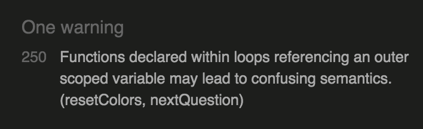

# **Testing**

## Contents
- [Validator Tests](#validator-tests)
    - [HTML W3C Validator](#w3c-validator)
    - [CSS Jigsaw Validator](#css-jigsaw-validator)
    - [JavaScript Jshint Validator](#css-jigsaw-validator)
- [Responsiveness](#responsiveness)
- [Browser Compatibility](#browser-compatibility)
- [Lighthouse Testing](#lighthouse-testing)
- [Bugs](#bugs)
    - [Resolved](#resolved)
    - [Unresolved](#unresolved)

## Validator Tests

### W3C Validator (HTML)
---
The HTML of the Capitals of the World Quiz was tested using [**W3C HTML Validator**](https://validator.w3.org/). 

**Index.html** - The validator returned four issues when checking the index.html page. Three of which were caused by an unclosed div tag. All issues were resolved by closing the element, with the only exception being an empty heading warning - this heading is intentionally empty so the warning was ignored.

**Other HTML** - All html inserted into the document throughout the application was also tested:

-   **Enter Username** - No errors were returned by the validator.
-   **Difficulty Selection** - No errors were returned by the validator.
-   **Game Area** - The validator showed that the h2 element was incorrectly closed with an h3 tag.
-   **Rules Page** - Returned multiple errors, all caused by a missing character in closing div tag.
-   **Scores Page** - No errors were returned by the validator.
-   **Modals** - All html introduced through modals were checked and no errors were returned by the validator.

All warnings returned by the validator have since been resolved and all HTML code passes through without issue (The exception being the empty h3 tag mentioned previously).

[Back to contents](#contents)

### **Jigsaw Validator (CSS)**
---
The HTML of the Capitals of the World Quiz was tested using the [**Jigsaw CSS Validator**](https://jigsaw.w3.org/css-validator/). 

The Jigsaw Validator returned two errors, both pertaining to two font-weight rules with the incorrect values. 

Both of these issues have since been resolved and the validator no longer shows any warnings.

[Back to contents](#contents)

## **Jshint Validator (JavaScript)**
---
The The JavaScript of the Capitals of the World Quiz was tested using the [**Jshint Javascript Validator**](https://jshint.com/). 

The validator initially showed 152 warnings. 

Many of these were resolved by including '**jshint esversion: 6**' at the top of the script - this specifies to the validator that the code uses ECMAScript 6 syntax. 

The vast majority of the remaining warnings were related to misplaced semi-colons and a few were undeclared variables that had been missed in the development process. All unecessary semi-colons were removed and undeclared variables declared.

The final warning encountered was resolved by rearranging the order of the showAnswer function, ensuring that the function was declared outside the loop.

All warnings indicated by Jshint were resolved and the validator no longer returns any warnings.

[Back to contents](#contents)

## **Responsiveness**

The application is desktop first, meaning that it was designed to function at its best on larger screen sizes, however it has also been made responsive to most viewport dimensions. The following devices are all of the specific resolutions that the application has been tested on:

The issue that kept returning seemed to be centering the modal in the middle of the screen vertically when it pops up - this was somewhat remedied through media queries but sometimes it will still appear slightly off center.

The application also struggled on very small mobile phones (320px width) during testing. Although still playable, the menu pushes icons off of the screen and disjoints the whole page.

Learning from the responsive testing, in future developments it might be beneficial to design the application in mobile format first and build up from there. Although the game holds up on most smaller devices it looks markedly better on desktop, so if there was more time that is an area that would be a focus of improvement.

[Back to contents](#contents)

## **Browser Compatibility** 
The Capitals of the World game has been tested on Google Chrome, Mozilla Firefox, Safari, and Opera. On each browser the game has been played through fully, every icon has been checked for functionality, the game has been tested on different viewport sizes, and links have been opened to ensure that they work correctly.

**Chrome** - No discernable issues.
**Mozilla Firefox** - No discernable issues.
**Safari** - The game overall felt slower, and there was a delay to the sound playing.
**Opera** - When not in full screen mode, game panel can spill over top and bottom of browser (Macbook).

Accross all sites the game functionality is retained, links open correctly, and buttons and icons work as expected. In terms of aesthetic, the responsiveness is unaffected on all of the browsers except for Opera. Due to the sidebar on Opera, in some situations the sizing is skewed - this was discovered on the Macbook 13" used to develop the application. The only other noticable change accross the browsers was a delay to sounds playing on Safari, this made the game feel slower and less responsive to user actions.

[Back to contents](#contents)

## **Lighthouse Testing**

The lighthouse testing initially showed worse SEO than expected - this issue was resolved by adding a meta description and keywords to the head of the html document. In order to improve the performance on mobile, the advice from the Lighthouse report was to compress site images. The only image on the entire application is the background image, and despite following the advice by compressing it, the performance stayed at a similar level.

[Back to contents](#contents)

## **Bugs**

### **Resolved**

**Answers Appearing Twice** - One of the main bugs throughout the development process was the issue of randomizing the answer options in the game. After trying different functions, the issue was finally resolved by selecting four random indexes and pushing their values to an array. By using the .includes() method, answers were prevented from appearing twice. The same method was then used for the correct answer where it would generate an index of which button to occupy, but would only execute if its value does not exist in the array (Since the change, double answers have yet to reappear in testing).

**Answers Not Displaying** - An issue that took up a fair amount of time in the development process was the answers not displaying in the game area when the game was started in specific scenarios. After hours of comparing vales and types of data, the solution was simply that the buttons had to be reassigned on every game iteration.

**Home/Back Icon** - In pages the home icon and back icon would not load the main menu. The reason for this was that the href in the a element was set from the position of the JavaScript file, and not from the index.html itself - where the JavaScript was inserting the html.

**Hover Issues** - During the game the CSS hover pseudo class would not function as expected. The issue was related to the CSS alterations made by JavaScript taking precedent. The bug was resolved by adding classes with greater importance to the function, meaning that the hover had greater priority.

[Back to contents](#contents)

### **Unresolved**

**Correct Answer** - A bug that remains unresolved is that sometimes the correct answer sound will not play when it succeeds another correct answer. This does not happen every time however, and appears to be affected by how quickly the next answer is triggered.

**Modal Position** - Throughout different viewport sizes, the modal will sometimes not appear in the center of the screen vertically.

[Back to contents](#contents)